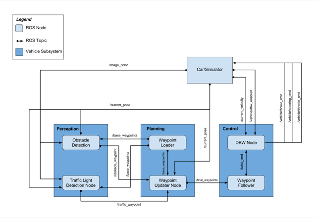

# Introduction
The following report is part of the final integration project for Udacity Self-Driving Car Nanodegree Program. The project consists in the integration of the main three subsystems for self-driving cars for ROS: Perception, Planning and Control.



# Perception

`tl_detector` node is in charge of detecting traffic lights and send the closest waypoint to the planner in order to stop when a red light is detected.

There are two main steps to accomplish this task:

1. Detect where in the dash cam is going to appear the next traffic light
2. Crop that image and send it to the classifier which identifies what color the light is at that moment

For the first step, you have to find the next waypoint corresponding to a traffic light. That will give you the position of the light. Once you have that information, you have to compute where in the image will the traffic light appear (using the pinhole camera model).


The interesting part of the code is this:

```python
cx = image_width/2
cy = image_height/2

rpy = tf.transformations.euler_from_quaternion(rot)
yaw = rpy[2]

(ptx, pty, ptz) = (point_in_world.x, point_in_world.y, point_in_world.z)

point_to_cam = (ptx * math.cos(yaw) - pty * math.sin(yaw),
                ptx * math.sin(yaw) + pty * math.cos(yaw),
                ptz)
point_to_cam = [sum(x) for x in zip(point_to_cam, trans)]

###################################################################
# Tweak to get it working on the simulator
if fx < 10:
    fx = 1400
    fy = 2000
    cx = image_width/2
    cy = image_height
###################################################################

x = -point_to_cam[1] * fx / point_to_cam[0];
y = -point_to_cam[2] * fy / point_to_cam[0];

x = int(x + cx)
y = int(y + cy)
```

After that, you extract a patch of the image and send it to a classifier to extract the state of the light. In case it's red, you have to publish the waypoint corresponding to the line closest to the traffic light in order to stop the car there.

# Planning

The `waypoint_updater` node will publish future waypoints from current position. It would also modify the speed given the traffic light condition. If no red light has been detected, this node will set the future waypoints' speed to be a constant number. As one will see in the simulator, the speed would be around 15 MPH when no traffic is detected. However when traffic light is detected and the right stopping region is entered, the future waypoints' speed would be reduced in a linear fashion.

### Setup
The `waypoint_updater` node is subscribed to three topics. Namely, they each are the `/current_pose`, `/base_waypoints`, `/traffic_waypoint`.

```python
	rospy.Subscriber('/current_pose', PoseStamped, self.pose_cb)
	rospy.Subscriber('/base_waypoints', Lane, self.waypoints_cb)
	rospy.Subscriber('/traffic_waypoint', Int32, self.traffic_cb)
```

And it is publishing the `\finaly_waypoints` topic to be send to the controller.
```python
	self.final_waypoints_pub = rospy.Publisher('final_waypoints', Lane, queue_size=1)
```

From the subscribers' side it will fetch the entire track, the vehicle's current position and the location of the traffic light.

The publisher would then make use of this information to compose future waypoints that are sent to the controller.

### User defined parameters

Beside the default `LOOKAHEAD_WPS`, the user can set a region where the vehicle is suppose to stop when red light is seen. They may adjust this with the `MIN_D` and `MAX_D`.

The `RefSpeed` defines each target waypoint's speed without the inteference of traffic. The `STOP_LINE` acts as a cutoff region where the vehicle must be absolutely stopped when seen red light.

The `BufferTime` defines a stale time for the vehicle to react to traffic light.  

### Future Waypoints

In side the `loop`, the waypoint_update node will continusly fetch an index from the `/base_waypoints` topic that is closely related the current position of the vehicle.

```python
    def nearest_wp(self, last_position, waypoints):
        """find nearest waypoint index to the current location"""
        dl = lambda a, b: math.sqrt((a.x-b.x)**2 + (a.y-b.y)**2  + (a.z-b.z)**2)
        nearest_distance = 9999;
        nearest_index = -1;
        for index, waypoint in enumerate(waypoints):
            waypoint_pos = waypoint.pose.pose.position
            distance = dl(last_position, waypoint_pos)
            if distance < nearest_distance:
                nearest_index = index
                nearest_distance = distance
        return nearest_index
```
This is then used to fetch next number of `LOOKAHEAD_WPS` and store them in a `lookAheadWpts` list, which will be published to the final waypoint topic `/final_waypoints`.
```python
    def get_future_wpts(self):
        # get index closest to current position
        self.last_wp = self.nearest_wp(self.last_pos.position, self.base_waypoints)+1
        # fetch next LOOKAHEAD number of waypoints
        ahead = min(len(self.base_waypoints),self.last_wp+LOOKAHEAD_WPS)
        # deep copy a set of lookahead pts
        lookAheadWpts = deepcopy(self.base_waypoints[self.last_wp:ahead])
        # construct default speed for lookAheadWpts
        for waypoint in lookAheadWpts:
            waypoint.twist.twist.linear.x = RefSpeed
```

### Incorporating Traffic Light

To decide when to slow down, there are two conditions to consider. One condition decides if the traffic light is truly ahead of the vehicle and in the region for slowing down. Another condition decides whether the traffic light is new by looking at its timestamp and comparing it against a `BufferTime` variable.

```python
    def decides_to_stop(self):
        # use two conditions to determine when to slow down and when to go full throttle
        legit_ahead = False
        new_traffic = False

        # when traffic light is first seen
        if self.traffic_light_time > rospy.get_time() - BufferTime:
            new_traffic = True
        # when traffic light is ahead
        if self.traffic_light_index > self.last_wp:
            # calculate the distance between car and the traffic_light
            d_car_light = self.distance(self.base_waypoints, self.last_wp, self.traffic_light_index)
            # determine if this distance falls within a suitable range
            if d_car_light > MIN_D and d_car_light < MAX_D:
                legit_ahead = True

        if legit_ahead == True and new_traffic == True:
            return True
        else:
            return False
```
Once the vehicle figures out it must slow down, it will asign each corresponding future waypoint a new but smaller speed than the reference speed `RefSpeed`.
```python
    def speed_before_traffic(self, d_car_light):
        """Return waypoint speed when traffic light is seen"""
        # speed = 0.0
        if d_car_light < MIN_D:
            speed = 0.0
        elif d_car_light < MAX_D:
            speed = (RefSpeed/2) * ((d_car_light - MIN_D) / (MAX_D - MIN_D))

        return speed
```
And finally it will construct message to be send to the final waypoint topic.
```python
    def construct_msg(self, lookAheadWpts):
        # construct message to be sent
        message_to_sent = Lane()
        message_to_sent.header.stamp = rospy.Time.now()
        message_to_sent.header.frame_id = self.frame_id
        message_to_sent.waypoints = lookAheadWpts
        return message_to_sent
```

# Controller

Each cycle of the main loop, the *controller* has the goal to compute the actuation to let the car follow the target longitudinal and angular speeds required by the *supervisor*. These target information, together with the current angular and longitudinal speeds, are defined in the messages transferred via __/current\_velocity__, and __/twist\_cmd__ topics by the __waypoint\_updater__. These values could change every iteration of the loop and the controller should satisfy the requests.

In addition, in order to let the system to be used also in cases where the driver wants to come back to the *manual* driving, the messages from the __/vehicle/dbw_enabled__ has to be considered. This message specify if the driver is currently driving the car by its own and the system need to be turned off and resetted.

### The Ros interface for the controller

The *dbw_node* defines the interface between the controller and the ros environment. The main purpose of this object is to communicate with all the other ros nodes (throw topics), and execute the controller step procedure to compute the actuations to be requested to the actuators.
As first step, all the communication channels are opened (as subscriber for some topics and publisher for others) and the controller is initialized as well.

```python
self.steer_pub = rospy.Publisher('/vehicle/steering_cmd',SteeringCmd, queue_size=1)
self.throttle_pub = rospy.Publisher('/vehicle/throttle_cmd', ThrottleCmd, queue_size=1)
self.brake_pub = rospy.Publisher('/vehicle/brake_cmd', BrakeCmd, queue_size=1)

rospy.Subscriber('/current_velocity', TwistStamped, self.current_velocity_cb)
rospy.Subscriber('/twist_cmd', TwistStamped, self.twist_cmd_cb)
rospy.Subscriber('/vehicle/dbw_enabled', Bool, self.dbw_enabled_cb)

params = {"wheel_base": wheel_base, "steer_ratio": steer_ratio, "min_speed": min_speed, "max_lat_accel": max_lat_accel, "max_steer_angle": max_steer_angle, "brake_deadband": brake_deadband, "accel_limit": accel_limit, "decel_limit": decel_limit}
self.controller = Controller(**params)
```

Then the node enters its loop procedure where the controller step is executed, and the resulting commands published in the relative topics.
Moreover, as mentioned before, the *dbw_node* also need to take into consideration the *dbw_enable* signal. In case the signal is True (means the driver is not driving the car manually), the controller has to be executed. Otherwise, the controller has to be resetted, and no actuation need to be computed

 ```python
if(self.dbw_en):
    parameters = {'twist_cmd': self.twist_cmd,
                  'current_vel': self.current_velocity}

    throttle, brake, steer = self.controller.control(**parameters)

    self.publish(throttle, brake, steer)
else:
    self.controller.reset()
```

### PIDs implementation

Even if the actuations required by the system were three (throttle, brake and steer), because of the strict connection between the throttle and the brake actuations, we decided to define a single PID both for throttle and brake.

```python
# Define the 2 PIDs: one for the throttle/brake control, the second one for the steering
self.pid_control = PID(5, .45, .125)#, mn = kwargs["decel_limit"], mx = kwargs["accel_limit"])
self.pid_steering = PID(.75 , 1.5, .0332, mn = -kwargs["max_steer_angle"], mx = kwargs["max_steer_angle"])
```

At each execution of the PIDs control, starting from the current and target values read from the topics, the actuation value is computed using all the three PID components (proportional, integral and derivative).

While the longitudinal speed values appears to be quite usable from the start, the target and current angular speed values required some more refinements.
1. First, the actuation degree of freedom we have for angular speed is the steering angle of the vehicle;
2. Second, the shared current values for angular speed appears to be quite noisy.

For this reason, both the target and current angular velocity were converted from angular speed to steering value throw the *yaw_controller* utility.

```python
# get current/target velocities (linear and angular) from the received messages in the topics 		
target_lin_vel = twist.twist.linear.x
target_ang_vel = twist.twist.angular.z

current_lin_vel = current_velocity.twist.linear.x
current_ang_vel = current_velocity.twist.angular.z

# convert angular speed (current and target) to steering angle (current and target)
current_steer = self.yaw_controller.get_steering(current_lin_vel, current_ang_vel, current_lin_vel)
target_steer = self.yaw_controller.get_steering(target_lin_vel, target_ang_vel, current_lin_vel)
```
For the noise, a preliminary analisys on the used signals was done both for the angular and longitudinal speed information retrieved from the topics.
While the logitudinal signal has appeared to be quite stable (both for the target and the current values), the steer values (transformed from the angular speed signals) appears to be quite noisy.

Since the PID controller for steering is directly influenced by both the current and the target steer (the input to the PID is exactly the steering error *self.pid_steering.step(steer_err, delta_t)*), two different *low_pass* filters were applied to the steers values.

Moreover, in order to avoid jerky steer maneuver due to high steer error or to the process noise, a filter is applied also to the output value of the PID itself.

The filters are firstly defined in the initialization stage of the controller itself, and then applied for each step of the controller.

```python
# Define the low pass filter to be applied to steering error value
self.steer_error_lpf = LowPassFilter(.4, .1)
self.steer_lpf = LowPassFilter(.5, .1)
self.steer_target_lpf = LowPassFilter(.3, .1)
...
target_steer = self.steer_target_lpf.filt(target_steer)
...
current_steer_filt = self.steer_error_lpf.filt(current_steer)
steer_err = target_steer - current_steer_filt
...
steer_rough = self.pid_steering.step(steer_err, delta_t)
steer = self.steer_lpf.filt(steer_rough)
'``
Once the values are transformed in the right form, the PIDs step function is executed and the actuation trasferred to the *dbw_node* for publishing.
```python

speed_err = target_lin_vel - current_lin_vel
throttle_brake = self.pid_control.step(speed_err, delta_t)

throttle = max(0.0,throttle_brake)
brake = max(0.0, -throttle_brake)
if(brake < self.brake_deadband):
    brake = 0.0

# Manage Steer using the dedicated PID
current_steer_filt = self.steer_error_lpf.filt(current_steer)
steer_err_rough = target_steer - current_steer_filt
steer_err = steer_err_rough
...
steer_rough = self.pid_steering.step(steer_err, delta_t)
steer = self.steer_lpf.filt(steer_rough)
...
return throttle, brake, steer
```
### Controller Calibration

In order to have good performances with the PID controllers, a parameter tuning is required. In particular need to be defined all the three gain used by the PID for the proportional, for the integral and for the derivative components.

The best approach that can be applied in such a calibration, is to define and modelize the system we are trying to control and then analitically compute the controller coefficients.

Since in this case some of the required information for such a modelization are not known, we decided to approach the calibration with an experimental approach. The well known _*Zeigler-Nichols*_ method was applied, and then a manual refinement was executed.

We first compute the *Zeigler-Nichols* calibration for the speed controller, fixing the steer angle to some different values (0, +-0.1, +-0.05).
Then the *Zeigler-Nichols* calibration for the steering PID - using the previously found calibration for the speed PID with a fixed target speed - verifying the critical proportional gain with several target steering angles (0, +-0.1, +-0.05).

### Steering management adjustment

After several trial, we figure out we were using a PID controller for something directly controllable. Differently from the longitudinal speed, that is connected to the throttle and the breaking pedals by all the physics of the car, the angular speed is directly related to the steering angle (that is exactly the actuator we are controlling).

However, analyzing in deep the signal coming from the *pure_pursuit* we realized it was too much noisy to be applied directly (even with the application of a low pass filter). So we finally decided to keep the pid.

### The *tl* classification node

The essence of this node is to process the incoming camera images in the driving direction to classify them as containing either a red light, yellow light, green light, or no light. The main task of the team in this part of the project was to find a model allowing fast detection with a fair accuracy.

> The proposed get_classification method takes a camera image as input and returns an ID corresponding to the color state of the traffic light in the image.

The input images were taken by the front of the car, both in the simulator program (4500 labeled images ca.) and using real an ROS bag video (more than 8000 labeled images). The team manually labeled a fraction of the two datasets.  

Initially, the dataset was not very balanced. To increase the sample size and to balance the frequency of different classes, a preprocessing step carried out random transformation including flipping, rotating (+/-20°), zooming (max 1.2x) and blurring.    

> The solution suggested here uses the *SqueezeNet architecture* (Iandola et al., 2017), a CNN successfully applied by D. Brailowsky - winner of the Traffic Lights Nexar challenge.   

The architecture begins with a standalone convolutional layer (conv1), followed by 8 so-called "Fire modules" and ending with a final convolutional layer (conv10). Each "Fire module" includes a squeeze convolutional layer (1x1 filter), acting as an input of a mix of 1x1 and 3x3 convolutional filters.  SqeezeNet also performs max-pooling (with a stride of 2) after layers conv1, fire 4, fire8 and conv10.

Starting off with a transfer learning from the SqeezeNet results available on GitHub website (https://github.com/deepScale/SqueezeNet, https://github.com/mynameisguy/TrafficLightChallenge-DeepLearning-Nexar), the team trained the model twice (one for the simulation environment and the second for the real environment). After some trial and error, it did take some training time to get respectively a 99.1% and a 97.4% accuracy on the two datasets.

Since one of the challenges was also to avoid latency, on a separate pipeline the team also tried to combine a computer vision (CV) approach with a very small CNN in a two-step approach. On the CV side, the cv2.HoughCircles transform parameters were set for finding colored circles (red, orange and yellow ones) with no false true outcomes. In this step, it was also possible to relabel few mistakes in the training data. Then, a small CNN (4 convolutional layers, with max-pool and dropout, followed by a final dense layer) allowed classifying the remaining images. This approach produced a 98.2% accuracy when applied on images from the simulator,  but it shows a very poor performance (65.4%) in detecting traffic lights colors in real images.

> Therefore, the team preferred the SqueezeNet approach for getting a greater accuracy.

# Conclusions

This was an exciting and interesting challenge. Having to learn how ROS works and each of the nodes interact was a difficult task, but the results worth it. The car manages to drive successfully and safely, breaking in every red light. After hours of testing, there are some edge cases that could take further investigation on a better solution, like for example, when the perception node missclassifies a green light missing it and having to wait until next time is green.
